# 🌐 Three-Tier Architecture with Load Balancing

## 🏗️ Introduction

This project demonstrates a Three-Tier Application Architecture with Load Balancing on AWS. It includes the Presentation, Application, and Database layers, designed for scalability, high availability, and secure communication between tiers using AWS services like EC2, ALB, and RDS.

## Architecture           Diagram

## AWS Infrastructure Components
## ⚙️ Create VPC & Subnets 

Create VPC: Name ThreeTierVPC, CIDR 10.0.0.0/16

Create Subnets:

Public: 10.0.1.0/24 (enable auto-assign IP)

Private: 10.0.2.0/24

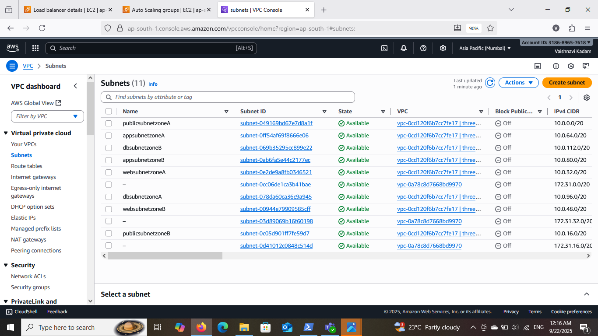

## ⚙️ Create RDS Subnet Group

Go to RDS → Subnet Groups → Create DB Subnet Group

Enter Name (e.g., ThreeTierDBSubnetGroup) and Description

Select your VPC

Add private subnets from different Availability Zones (AZs)

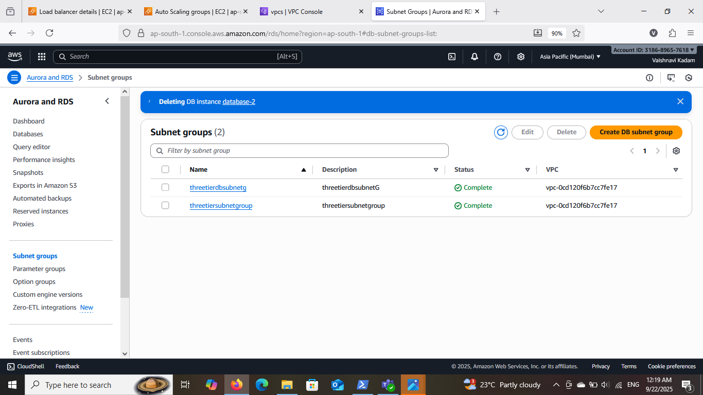

## ⚙️ Create RDS Database 

Go to RDS → Create database

Select Engine (MySQL/PostgreSQL) and Free Tier

Configure DB: Name ThreeTierDB, username & password, instance class db.t2.micro

Select VPC & private subnet, Public access = No

Attach Security Group allowing app tier access

Click Create database → Wait until status is Available

Note the DB endpoint for application connectivity.

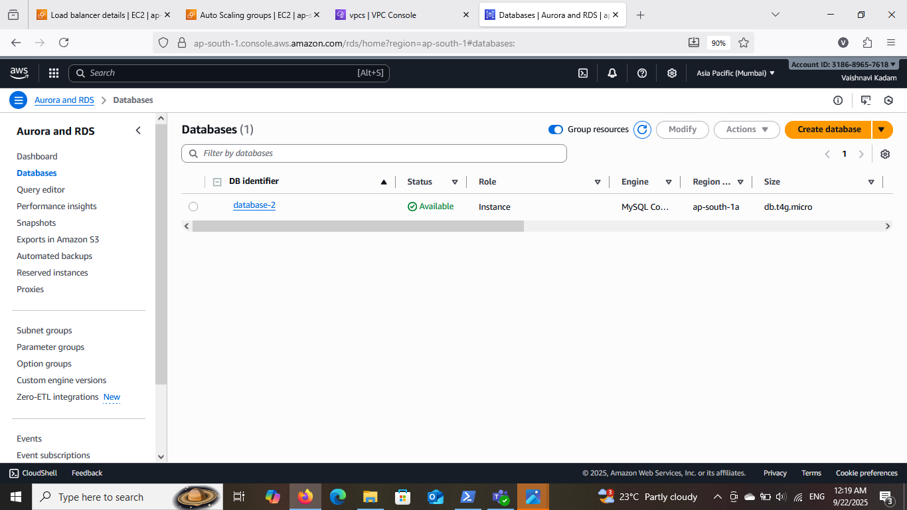

## ⚙️ Create Internet Gateway

Go to AWS Console → VPC → Internet Gateways → Create internet gateway

Enter a Name tag (e.g., ThreeTierIGW)

Click Create internet gateway

Attach IGW to your VPC:

Select the IGW → Actions → Attach to VPC → Choose your VPC → Click Attach

After attaching, update the public route table to direct 0.0.0.0/0 traffic through this IGW.

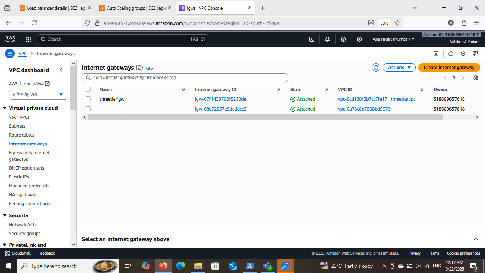

## ⚙️ Create Route Tables

Go to VPC → Route Tables → Create route table

Name: PublicRouteTable

Select your VPC

Add route for public internet access:

Destination: 0.0.0.0/0

Target: Internet Gateway (IGW)

Associate subnets:

Public subnet → Public route table

Private subnet → Default/private route table (no internet)

This ensures public subnets can access the internet, while private subnets remain internal.

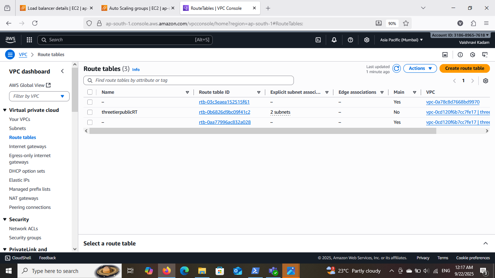

## 🗺️ AWS Resource Map

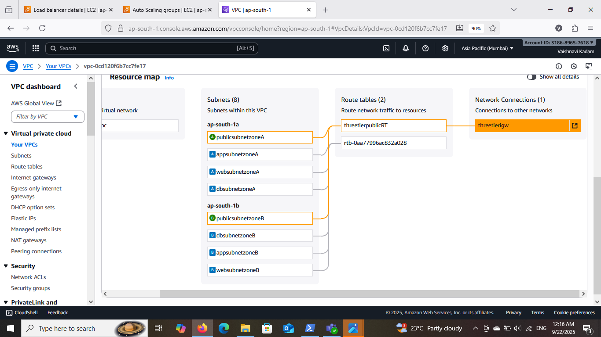

## ⚙️ Create Security Groups

Go to VPC → Security Groups → Create Security Group

Enter Name and Description (e.g., WebSG, AppSG, DBSG)

Select your VPC

Add Inbound Rules:

WebSG: Allow HTTP/HTTPS from anywhere, SSH from Jump Server

AppSG: Allow traffic from WebSG only, SSH from Jump Server

DBSG: Allow DB port (e.g., 3306) from AppSG only

Configure Outbound Rules (default allows all)

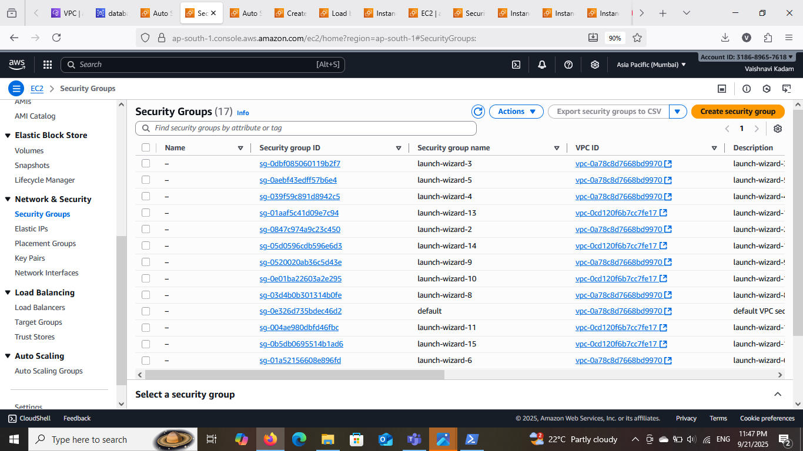

## ⚙️ Create EC2 Instances 

Jump Server – Public subnet, SSH access from your IP, bastion host for private servers.

Web Server – Public subnet, HTTP/HTTPS access, receives traffic from users.

App Server – Private subnet, communicates with web server, runs application logic.

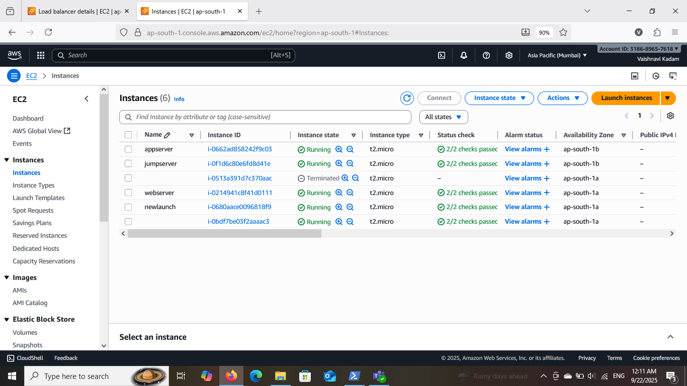

## ⚙️ Auto Scaling Group 

Create ASG in EC2 → Auto Scaling Groups

Select Launch Template/Configuration and name it

Choose VPC & Subnets (public for web, private for app)

Set min, max, desired instances and scaling policy

Attach Load Balancer (for web tier)

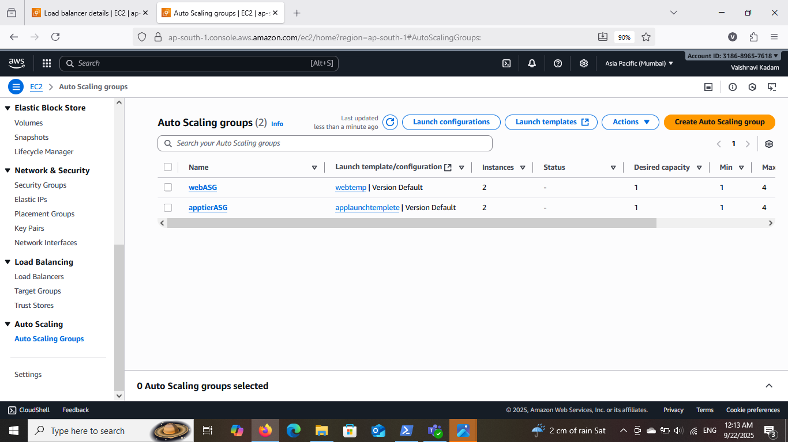

## ⚙️ Load Balancer

Go to EC2 → Load Balancers → Create ALB

Name it and select Internet-facing, public subnets

Configure Listeners (HTTP/HTTPS) and Security Group

Create Target Group and register web server instances

Review and create

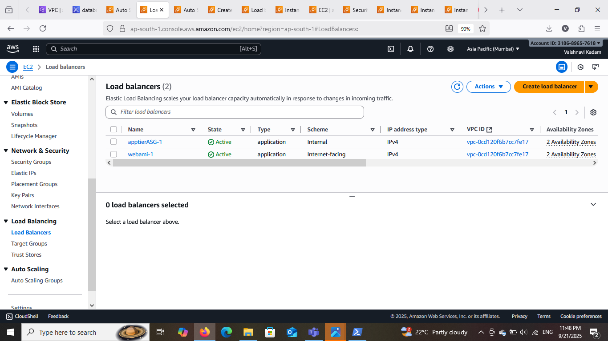

## output :

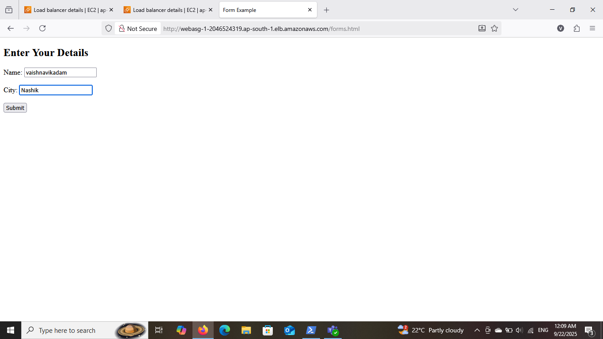

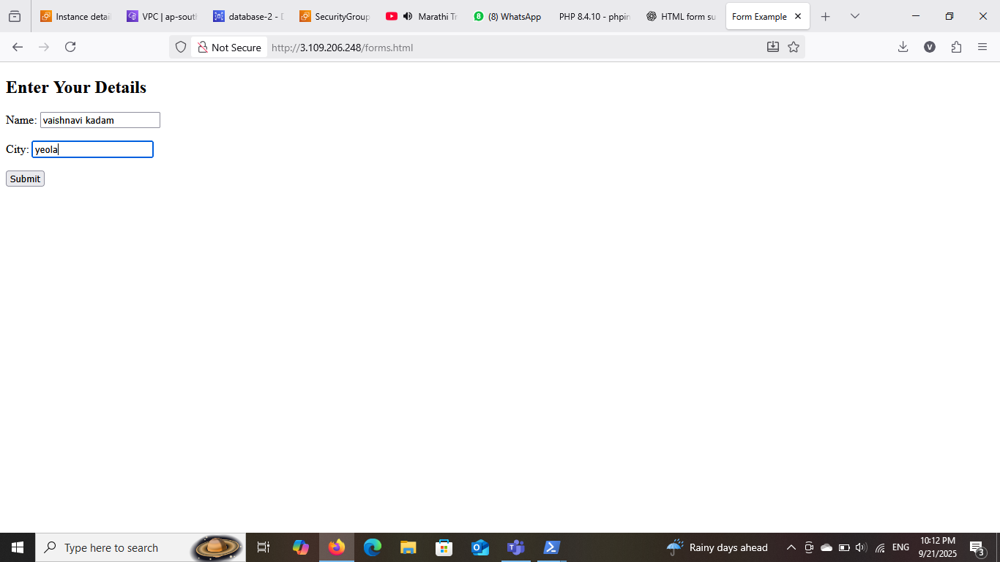

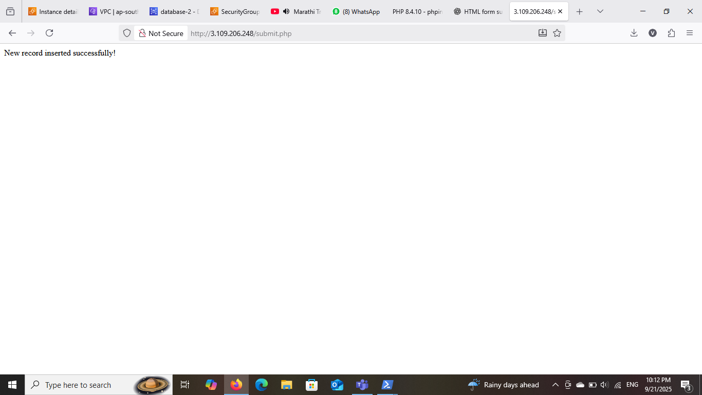

## Conclusion :

This project demonstrates a 3-tier architecture with load balancing on AWS. It ensures high availability, scalability, and centralized data management. The HTML form (forms.html) and PHP script (submit.php) work seamlessly to insert user data into the RDS database, showing a practical cloud-based multi-tier web application.

